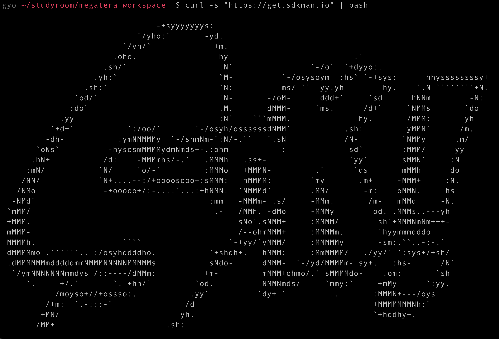
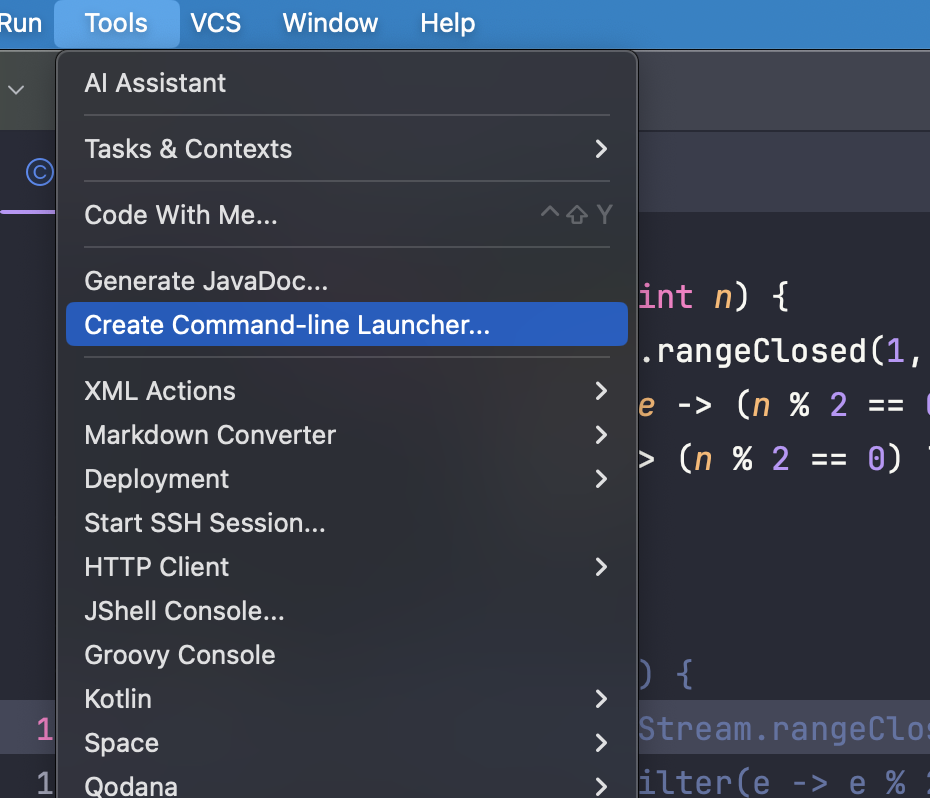
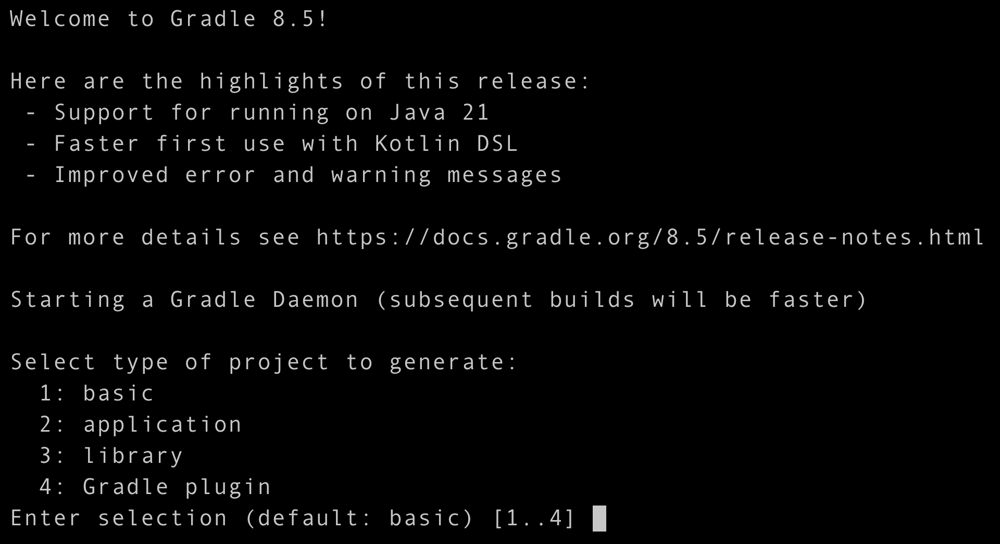
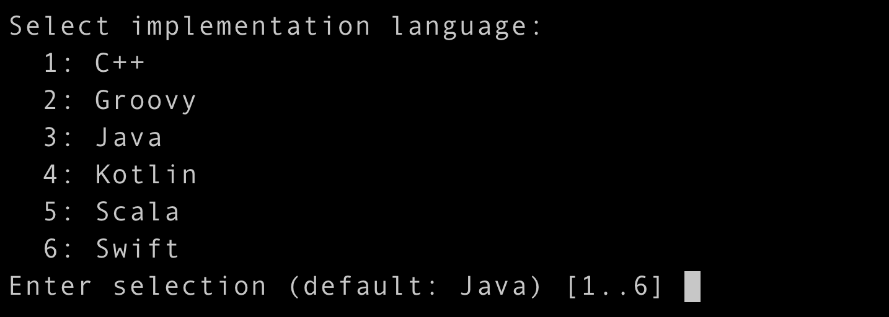
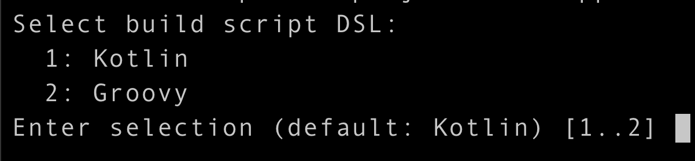
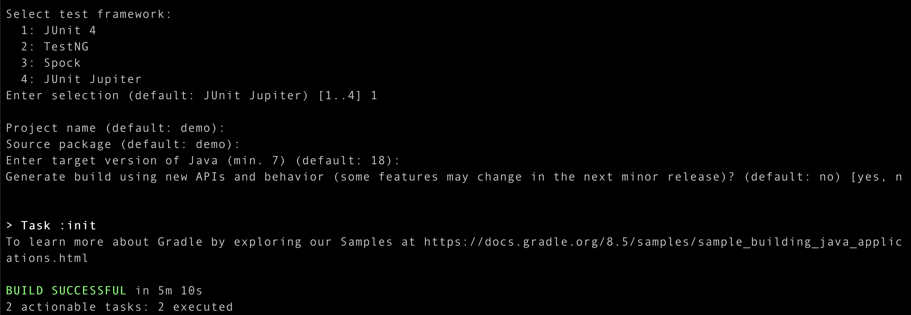

# 개발 환경 설정

## 자바 개발 환경 설정

### 1. 아래 링크로 연결된 SDKMAN! 사이트에서 설치 주소를 카피

[https://sdkman.io/](https://sdkman.io/)

### 2. 터미널 창에서 복사된 주소를 붙여넣고 엔터를 입력해 설치



### 3. 터미널 창에서 아래와 같은 명령어를 입력해 ~/.zprofile 파일에 범용 설정을 추가

```<bash>
export SDKMAN_DIR="$HOME/.sdkman"
[[ -s "$HOME/.sdkman/bin/sdkman-init.sh" ]] && source "$HOME/.sdkman/bin/sdkman-init.sh"
```

#### 참고

- export는 환경 변수를 설정하는 명령어입니다. 여기서는 SDKMAN_DIR이라는 환경 변수를 생성하고 해당 디렉토리 경로를 할당합니다.

- $HOME은 사용자의 홈 디렉토리를 나타냅니다. 따라서 .sdkman 디렉토리는 사용자의 홈 디렉토리 안에 생성됩니다.

- [[...]]는 조건문을 나타냅니다. 여기서는 파일이 존재하고 크기가 0보다 큰지를 확인하고 있습니다.

- -s는 파일이 존재하면서 크기가 0보다 큰지를 검사하는 옵션입니다. [[-s 파일경로]]와 같이 사용됩니다. 따라서 "$HOME/.sdkman/bin/sdkman-init.sh" 파일이 존재하면 true를 반환합니다.

- source 명령어는 스크립트 파일을 '현재 쉘'에서 실행하는 데 사용됩니다. 즉, sdkman-init.sh 스크립트를 현재 쉘에서 실행하여 SDKMAN을 초기화합니다.

### 4. 설치 후 터미널을 종료하고 다시 새로운 터미널을 실행 후 SDKMAN! 명령어 사용해보기

```<bash>
sdk --help
```

### 5. 아래의 명령어로 18 버젼의 jdk를 설치 및 확인

```<bash>
# Temurin jdk 목록 확인
sdk list java | grep tem

# jdk 설치
sdk install java 18.0.1-tem

# 설치된 jdk 목록 확인
sdk list java | grep local
sdk list java | grep installed

# 현재 사용중인 jdk 확인
sdk current

# 현재 java 버전 확인
java —-version
```

### 6. 아래 명령어들을 입력해 Gradle을 설치 및 확인

```<bash>
# gradle 버젼 목록 확인
sdk list gradle

# gradle 설치
sdk install gradle

# 현재 버젼 확인
sdk current
```

---

## IntelliJ IDEA 설정

### 단축 명령어 설정

- 상단 메뉴 중 tools → create command line 를 클릭하거나 shift 키를 두번 눌러 create command line-luncher 를 검색하여 클릭해줍니다. ok 를 눌러 intellij 열기 명령어를 생성해줍니다.  
  

```<bash>
export PATH=$PATH:/Applications/IntelliJ\ IDEA.app/Contents/MacOS
```

#### 환경변수 영구 설정하기

- 무슨 쉘을 사용하고 있는지 확인

```<bash>
echo $SHELL
/bin/zsh
```

- zsh 설정파일을 수정

```<bash>
echo 'export PATH=$PATH:/Applications/IntelliJ\ IDEA.app/Contents/MacOS' >> ~/.zshrc
source ~/.zshrc
```

- 생성한 명령어는 iterm에서 해당 폴더를 intelliJ를 이용해 프로젝트를 여는데 사용됩니다. 프로젝트를 열 때 터미널에서 idea <경로> 명령어를 이용해 열어주세요.

```<bash>
idea .
```

## httpie 설치하기

[설치 링크](https://httpie.io/docs/cli/main-features)

---

## 프로젝트 만들어보기

### Gradle로 프로젝트 시작하기

Gradle과 JDK를 모두 설치하셨다면 Gradle의 init명령어로 프로젝트를 시작할 수 있습니다. 먼저 빈 폴더를 하나 만들고 폴더에서 gradle init명령어를 실행합니다.

```<bash>
mkdir demo
cd demo
gradle init
```

명령어를 실행하면 무엇을 만들 것인지, 어떤 언어로 만들 것인지, 빌드 스크립트는 무엇으로 만들 것인지, 테스트 프레임워크는 무엇으로 만들 것인지 물어봅니다.

(1) project type 선택



(2) 언어 선택



(3) build script DSL 선택



(4) 나머지 과정 생략...



선택해서 완료하면 폴더 내에 다음과 같이 폴더 구조가 생긴 것을 확인할 수 있습니다.

```<bash>
gyo ~/studyroom/megatera_workspace/demo  $ tree .
.
├── app
│   ├── build.gradle
│   └── src
│       ├── main
│       │   ├── java
│       │   │   └── demo
│       │   │       └── App.java
│       │   └── resources
│       └── test
│           ├── java
│           │   └── demo
│           │       └── AppTest.java
│           └── resources
├── gradle
│   ├── libs.versions.toml
│   └── wrapper
│       ├── gradle-wrapper.jar
│       └── gradle-wrapper.properties
├── gradlew
├── gradlew.bat
└── settings.gradle

13 directories, 9 files
```

- `gradle`폴더는 Gradle warpper를 위한 파일들이 모여있습니다.
- `gradlew`는 Gradle wrapper 스크립트를 실행할 수 있는 파일입니다. 우리가 애플리케이션을 실행하거나 빌드, 테스트 등을 실행할 때 이 파일로 실행합니다.
- `settings.gradle`파일은 프로젝트 설정 파일입니다. 프로젝트의 이름과 여러 프로젝트들이 있을 때 설정하는 파일입니다.
- `build.gradle`은 애플리케이션 빌드 스크립트 파일인데 의존성 관리도 이 파일에서 합니다.
- `app` 폴더에 `src`파일에는 우리가 실제로 작성할 파일들이 위치하는 곳이고, `test`는 테스트 파일들이 모여있는 폴더입니다.

### 실행하기

다음 명령어를 실행하여 애플리케이션을 실행할 수 있습니다.

```<bash>
./gradlew run
```
