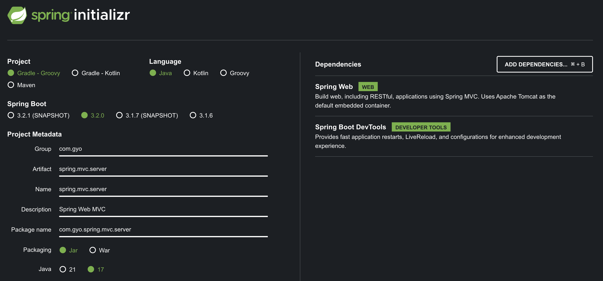

# Spring Web MVC

## contents

### MVC(Model-View-Controller) 아키텍처 패턴

- [Model View Controller](https://martinfowler.com/eaaCatalog/modelViewController.html)
- [GUI Architectures](https://martinfowler.com/eaaDev/uiArchs.html)

#### View

표현

#### Controller

입력

#### Model

그 외의 모든 것 (사실상 도메인 모델)

1. 관심사의 분리 : MVC가 추구하는 것이다. 흔히 UI와 비즈니스 로직의 분리를 말한다.
2. 웹에서는 원래 MVC와 다르게 일반적으로 View에서 참조하는 표현 또는 데이터를 말한다.
   - Rails는 Active Record 아키텍처 패턴을 통해 Model과 DB를 긴밀하게 연결시켰고, Rails의 성공은 다른 곳에도 많은 영향을 끼쳤다.
     - [Active Record](https://martinfowler.com/eaaCatalog/activeRecord.html)
     - [ActiveRecord considered harmful](https://steveklabnik.com/writing/active-record-considered-harmful)
   - Spring Web MVC는 Map과 유사한 Model 인터페이스를 제공한다..
     - [ModelMap](https://docs.spring.io/spring-framework/docs/current/javadoc-api/org/springframework/ui/package-summary.html)
     - 애플리케이션 전체가 아니라, 웹과 관련된 부분(UI Layer)에서만 MVC 개념을 활용할 수 있도록 돕는다. 관심사의 분리를 더 심화할 기회를 제공한다.

최근에는 더 복잡한 걸 잘 다룰 수 있는 더 커다란 아키텍처가 필요하다는 걸 알게 되었다.  
Spring WebFlux 등에서는 Controller 대신 Handler란 개념을 사용한다. Hexagonal Architecture를 적극 활용한다면 그냥 Input Adapter 중 하나가 된다(참고로, DB는 Output Adapter).
물론 웹에선 Controller만으로 충분하다.

([Get Your Hands Dirty on Clean Architecture의 사례](https://github.com/thombergs/buckpal/blob/master/src/main/java/io/reflectoring/buckpal/account/adapter/in/web/SendMoneyController.java))

###

### Spring Web MVC Example

아래와 같이 Spring Initializer을 사용한다.



간단하게 RestController만 구현하면 된다.

```<java>
package com.gyo.spring.mvc.server.contollers;

import org.springframework.web.bind.annotation.GetMapping;
import org.springframework.web.bind.annotation.RestController;

@RestController
public class WelcomeController {
    @GetMapping("/")
    String home() {
        return "Hello world!";
    }
}
```

이제 curl 로 요청을 보내면 응답을 받을 수 있다.

```<bash>
>> 입력
curl localhost:8080/sub
>> 출력
Hello world!
```

#### 어노테이션 레퍼런스

- [@RestController](https://docs.spring.io/spring-framework/docs/current/javadoc-api/org/springframework/web/bind/annotation/RestController.html)
  - [@Controller](https://docs.spring.io/spring-framework/docs/current/javadoc-api/org/springframework/stereotype/Controller.html)
  - [@ResponseBody](https://docs.spring.io/spring-framework/docs/current/javadoc-api/org/springframework/web/bind/annotation/ResponseBody.html)
- [@GetMapping](https://docs.spring.io/spring-framework/docs/current/javadoc-api/org/springframework/web/bind/annotation/GetMapping.html)
  - [@RequestMapping](https://docs.spring.io/spring-framework/docs/current/javadoc-api/org/springframework/web/bind/annotation/RequestMapping.html)
