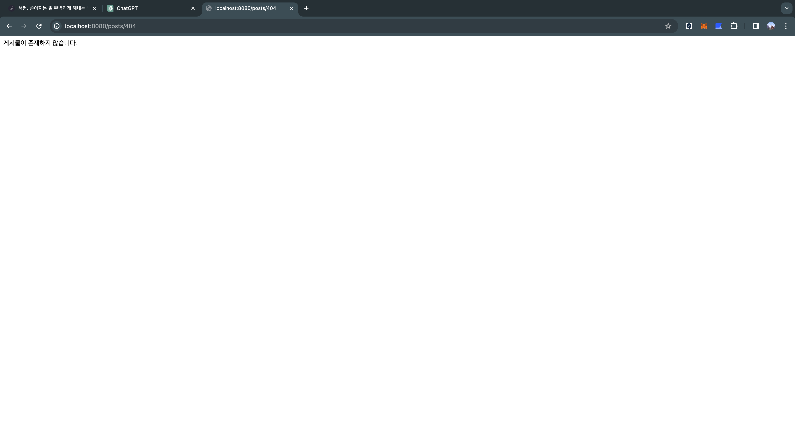
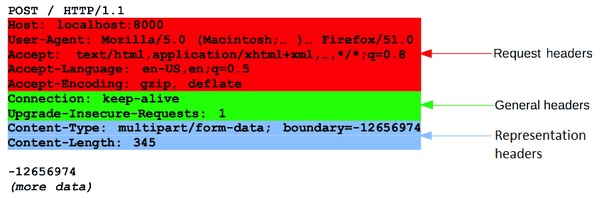

# Spring Web MVC로 구현

## Contents

### 부트를 켜보자

부트를 run 하고 http 요청을 보내보았다.

```<bash>
gyo ~/studyroom/survival-backend-git-book/src/week2/demo-rest-api [main] $ http localhost:8080
HTTP/1.1 404
Connection: keep-alive
Content-Type: application/json
Date: Thu, 21 Dec 2023 13:05:33 GMT
Keep-Alive: timeout=60
Transfer-Encoding: chunked
Vary: Origin
Vary: Access-Control-Request-Method
Vary: Access-Control-Request-Headers

{
    "error": "Not Found",
    "message": "No static resource .",
    "path": "/",
    "status": 404,
    "timestamp": "2023-12-21T13:05:33.576+00:00",
    "trace": "org.springframework.web.servlet.resource.NoResourceFoundException: No static resource .\n\tat org.springframework.web.servlet.resource.ResourceHttpRequestHandler.handleRequest(ResourceHttpRequestHandler.java:585)\n\tat org.springframework.web.servlet.mvc.HttpRequestHandlerAdapter.handle(HttpRequestHandlerAdapter.java:52)\n\tat org.springframework.web.servlet.DispatcherServlet.doDispatch(DispatcherServlet.java:1089)\n\tat org.springframework.web.servlet.DispatcherServlet.doService(DispatcherServlet.java:979)\n\tat org.springframework.web.servlet.FrameworkServlet.processRequest(FrameworkServlet.java:1014)\n\tat org.springframework.web.servlet.FrameworkServlet.doGet(FrameworkServlet.java:903)\n\tat jakarta.servlet.http.HttpServlet.service(HttpServlet.java:564)\n\tat org.springframework.web.servlet.FrameworkServlet.service(FrameworkServlet.java:885)\n\tat jakarta.servlet.http.HttpServlet.service(HttpServlet.java:658)\n\tat org.apache.catalina.core.ApplicationFilterChain.internalDoFilter(ApplicationFilterChain.java:205)\n\tat org.apache.catalina.core.ApplicationFilterChain.doFilter(ApplicationFilterChain.java:149)\n\tat org.apache.tomcat.websocket.server.WsFilter.doFilter(WsFilter.java:51)\n\tat org.apache.catalina.core.ApplicationFilterChain.internalDoFilter(ApplicationFilterChain.java:174)\n\tat org.apache.catalina.core.ApplicationFilterChain.doFilter(ApplicationFilterChain.java:149)\n\tat org.springframework.web.filter.RequestContextFilter.doFilterInternal(RequestContextFilter.java:100)\n\tat org.springframework.web.filter.OncePerRequestFilter.doFilter(OncePerRequestFilter.java:116)\n\tat org.apache.catalina.core.ApplicationFilterChain.internalDoFilter(ApplicationFilterChain.java:174)\n\tat org.apache.catalina.core.ApplicationFilterChain.doFilter(ApplicationFilterChain.java:149)\n\tat org.springframework.web.filter.FormContentFilter.doFilterInternal(FormContentFilter.java:93)\n\tat org.springframework.web.filter.OncePerRequestFilter.doFilter(OncePerRequestFilter.java:116)\n\tat org.apache.catalina.core.ApplicationFilterChain.internalDoFilter(ApplicationFilterChain.java:174)\n\tat org.apache.catalina.core.ApplicationFilterChain.doFilter(ApplicationFilterChain.java:149)\n\tat org.springframework.web.filter.CharacterEncodingFilter.doFilterInternal(CharacterEncodingFilter.java:201)\n\tat org.springframework.web.filter.OncePerRequestFilter.doFilter(OncePerRequestFilter.java:116)\n\tat org.apache.catalina.core.ApplicationFilterChain.internalDoFilter(ApplicationFilterChain.java:174)\n\tat org.apache.catalina.core.ApplicationFilterChain.doFilter(ApplicationFilterChain.java:149)\n\tat org.apache.catalina.core.StandardWrapperValve.invoke(StandardWrapperValve.java:167)\n\tat org.apache.catalina.core.StandardContextValve.invoke(StandardContextValve.java:90)\n\tat org.apache.catalina.authenticator.AuthenticatorBase.invoke(AuthenticatorBase.java:482)\n\tat org.apache.catalina.core.StandardHostValve.invoke(StandardHostValve.java:115)\n\tat org.apache.catalina.valves.ErrorReportValve.invoke(ErrorReportValve.java:93)\n\tat org.apache.catalina.core.StandardEngineValve.invoke(StandardEngineValve.java:74)\n\tat org.apache.catalina.connector.CoyoteAdapter.service(CoyoteAdapter.java:340)\n\tat org.apache.coyote.http11.Http11Processor.service(Http11Processor.java:391)\n\tat org.apache.coyote.AbstractProcessorLight.process(AbstractProcessorLight.java:63)\n\tat org.apache.coyote.AbstractProtocol$ConnectionHandler.process(AbstractProtocol.java:896)\n\tat org.apache.tomcat.util.net.NioEndpoint$SocketProcessor.doRun(NioEndpoint.java:1744)\n\tat org.apache.tomcat.util.net.SocketProcessorBase.run(SocketProcessorBase.java:52)\n\tat org.apache.tomcat.util.threads.ThreadPoolExecutor.runWorker(ThreadPoolExecutor.java:1191)\n\tat org.apache.tomcat.util.threads.ThreadPoolExecutor$Worker.run(ThreadPoolExecutor.java:659)\n\tat org.apache.tomcat.util.threads.TaskThread$WrappingRunnable.run(TaskThread.java:61)\n\tat java.base/java.lang.Thread.run(Thread.java:833)\n"
}
```

흠 엄청 보기 안 좋다. 지금 예외가 발생했는데 이건 정적 페이지가 없어서 발생했다. 이런 예외를 안 보이게 하기 위해서 application.yml에서 설정을 해주자. 이를 통해 스프링 부트의 설정 정보를 지정할 수 있다.

```<yml>
server:
  error:
    include-exception: false
    include-stacktrace: on_param

```

설정을 끝내고 다시 요청을 보내면 결과는 다음과 같다.

```<bash>
HTTP/1.1 404
Connection: keep-alive
Content-Type: application/json
Date: Thu, 21 Dec 2023 13:08:16 GMT
Keep-Alive: timeout=60
Transfer-Encoding: chunked
Vary: Origin
Vary: Access-Control-Request-Method
Vary: Access-Control-Request-Headers

{
    "error": "Not Found",
    "message": "No static resource .",
    "path": "/",
    "status": 404,
    "timestamp": "2023-12-21T13:08:16.522+00:00"
}

```

내용을 살펴보면 MIME 타입으로 json 형식을 사용한다. 이를 통해서 스프링 부트의 내장 WAS인 톰켓은 기본적으로 json을 MIME 타입으로 처리함을 알 수 있다. 404 Status code도 기본적으로 톰켓에서 해준다!

### Post Controller 구현하기

게시물과 관련된 응답을 처리하는 컨트롤러를 구현한다. 이는 스프링에서 제공하는 객체다.

#### 1. 게시물 목록 읽어오는 REST API

컨트롤러라는 객체를 통해 수행하는 첫번째 연산은 게시물 목록을 읽어오는 것이다. 클라이언트 layer에서 요청을 보낼 때 REST API를 통해서 요청을 보내기러 약속을 했다. 업계에서 범용적으로 사용하는 Collection Pattern을 활용해 게시물 목록을 표현할 수 있는 REST API를 구현한다.  
원론적인 REST API의 인터페이스 개념에서 생각해보면 컨트롤러라는 객체의 연산이 list()라는 함수로 구현되었다. 이 함수의 시그니처는 Collection Pattern을 적용해 RESTful 하게 표현되었다.

```<java>
@RestController
public class PostController {

    // Read
    @GetMapping("/posts")
    public String list() {
        return "게시물 목록";
    }
}
```

아직 게시물 목록을 불러오는 구체적인 방법이 정해지지 않아서 단순하게 문자열을 반환한다.

##### @RestController는 왜 필요할까?

스프링의 RestController 어노테이션을 달고 있는 메서드의 반환값(여기서는 "게시물 목록"이라는 String)은 HTTP 응답의 body로 변환된다. 이것이 스프링 프레임워크가 해주는 일이다.

사실 RestController는 2가지 어노테이션이 합쳐진 결과다.  
첫번째는 @Controller로 HTTP 요청을 처리하는 객체임을 나타내는 어노테이션이다. MVC에서 View를 반환하거나 Model에 데이터를 추가하는 기능을 담당하도록 약속했다.

두번째는 @ResponseBody다. 이 어노테이션의 기능이 메서드의 반환값을 HTTP 응답의 body로 변환하는 것이다.

다시 돌아와서 http 요청을 보내보자.

```<bash>
gyo ~/studyroom/survival-backend-git-book/src/week2/demo-rest-api [main] $ curl localhost:8080/posts
게시물 목록
```

브라우저에서도 확인할 수 있다.


#### 2. 개별 게시물을 읽어오는 REST API

게시물 상세(개별)을 읽어오는 기능을 추가해보자.

```<java>
@GetMapping("posts/{id}")
    public String detail(
            @PathVariable String id
    ) {
        if (id.equals("404")) {
            throw new PostNotFoundException();
        }
        return "게시물 상세: " + id;
    }
```

Collection pattern을 적용했다. 클라이언트 측에서는 id를 url에 경로 매개변수로 포함해서 요청을 보낸다.
실제로는 id값 같은 경우 API 명세 문서 등을 통해서 약속을 해야한다.

여기서 id의 자료형을 String으로 하긴 했는데 이게 사실 좋지 못한 방법일 수 있다. 아래처럼 숫자가 아닌 값을 넘겨도 오류가 발생하지 않는다.

```<bash>
curl localhost:8080/posts/jak
게시물 상세: jak
```

그래서 추가적인 예외처리가 필요하다. 우선 404라는 id를 가지는 경우가 없다고 가정하고 예외처리를 해보자.  
새로운 예외를 생성한다.

```<java>

public class PostNotFoundException extends RuntimeException {

}
```

RuntimeException을 상속받는 예외를 생성했다. 왜 RuntimeException을 상속했을까? 구현이 간편해서다.

우선 RuntimeException 및 그 하위 클래스들은 `unchecked exception`에 해당하며, 컴파일러가 예외 처리를 강제하지 않는다. 따라서 이를 throw하는 메서드의 시그니처에 throw 예약어를 안 적어도 된다. 개별 게시물을 불러오는 메서드 시그니처를 확인해보자.

이제 예외처리를 하지 않은 상태에서 예외 상황을 만들어보겠다.

```<bash>
curl localhost:8080/posts/404
{"timestamp":"2023-12-21T16:01:17.062+00:00","status":500,"error":"Internal Server Error","message":"No message available","path":"/posts/404"}%
```

뭔가 이상하지 않은가? 상태코드가 500이다. 서버의 잘못인 것 처럼 응답하게 되었다. 실제로는 클라이언트 측에서 없는 id로 잘못 요청을 보냈다는 것을 가정한다. 따라서 이 예외를 처리하고 상태코드도 클라이언트의 잘못인 것을 명시하도록 변경해보겠다.

```<java>
@ExceptionHandler(PostNotFoundException.class)
    @ResponseStatus(HttpStatus.NOT_FOUND)
    public String postNotFound() {
        return "게시물이 존재하지 않습니다.";
    }
```

상태코드도 404를 반환하게 변경하고, 응답 본문도 깔끔하게 게시물이 존재하지 않는다는 것을 명시했다.


#### 3. 게시물을 생성하는 REST API

```<java>
// Create
    @PostMapping("/posts")
    @ResponseStatus(HttpStatus.CREATED)
    public String create(@RequestBody(required = false) String body) {
        return "게시물 생성 : " + body;
    }
```

특이한 것은 @RequestBody 어노테이션에 옵션을 주었다. 요청시 body를 반드시 넣지 않아도 된다는 옵션이다.

그래서 진짜 body를 넣지않고 요청해보겠다.

```<bash>
http POST localhost:8080/posts
HTTP/1.1 201
Connection: keep-alive
Content-Length: 23
Content-Type: text/plain;charset=UTF-8
Date: Thu, 21 Dec 2023 16:12:19 GMT
Keep-Alive: timeout=60

게시물 생성 : null

```

body를 넣지 않아서 create 메서드에서 body 값이 null로 반환되었다.

이제 body를 넣어서 요청해보자.

```<bash>
 http POST localhost:8080/posts title=123 gym="ggo"
HTTP/1.1 201
Connection: keep-alive
Content-Length: 49
Content-Type: application/json
Date: Thu, 21 Dec 2023 16:14:35 GMT
Keep-Alive: timeout=60

게시물 생성 : {
    "gym": "ggo",
    "title": "123"
}
```

결과를 살펴보면 body가 json 형태임을 알 수 있다. 즉 httpie에서도 요청을 보낼 때 기본적으로 body에 json형태로 보낸다는 것을 알 수 있다.
Http 메세지의 구조를 생각해보면 헤더 중 [Accept](https://developer.mozilla.org/ko/docs/Web/HTTP/Headers/Accept) 필드의 값이 application/json이라는 말이다. 따라서 부트에서도 body를 json으로 응답을 하게 된다. (json으로 요청했으니 json으로 받는다고 약속하게 된 것)


좀 더 깔끔하게 완전히 Json 형태로 보내기 위해 return에서 문자열 처리를 했다.

```<java>
// Create
    @PostMapping("/posts")
    @ResponseStatus(HttpStatus.CREATED)
    public String create(@RequestBody(required = false) String body) {
        return "{\"action\": \"게시물 생성\", \"body\": \""
                + body.replace("\"", "\\\"")
                + "\"}";
    }
```

```<bash>
http POST localhost:8080/posts title=123 gym="ggo"
HTTP/1.1 201
Connection: keep-alive
Content-Length: 80
Content-Type: application/json
Date: Thu, 21 Dec 2023 16:29:13 GMT
Keep-Alive: timeout=60

{
    "action": "게시물 생성",
    "body": "{\"title\": \"123\", \"gym\": \"ggo\"}"
}

```

이제 (required = false)을 빼고, body를 넣지않고 요청을 해보자.

```<java>
// Create
    @PostMapping("/posts")
    @ResponseStatus(HttpStatus.CREATED)
    public String create(@RequestBody String body) {
        return "{\"action\": \"게시물 생성\", \"body\": \""
                + body.replace("\"", "\\\"")
                + "\"}";
    }
```

```<bash>
http POST localhost:8080/posts
HTTP/1.1 400
Connection: close
Content-Type: application/json
Date: Thu, 21 Dec 2023 16:31:34 GMT
Transfer-Encoding: chunked

{
    "error": "Bad Request",
    "message": "Required request body is missing: public java.lang.String com.gyo.api.rest.demo.controllers.PostController.create(java.lang.String)",
    "path": "/posts",
    "status": 400,
    "timestamp": "2023-12-21T16:31:34.301+00:00"
}

```

400 status code를 확인할 수 있다. 클라이언트가 body를 넣지 않은 잘못이다!

#### 4. 게시물을 수정하는 REST API

이번에는 id를 PathVaribale로 넘겨서 해당 id의 게시물을 수정하는 REST API를 만들어보자. 차이점은 다음과 같다.

1. PatchMapping을 통해 HTTP Method가 PATCH임을 명시하도록 수정했다.
2. PathVariable로 id 값을 넘겼다.

```<java>
// Update
    @PatchMapping("/posts/{id}")
    public String update(@PathVariable String id, @RequestBody String body) {
        return "{\"action\": \"게시물 수정: " + id + "\",\"body\": \""
                + body.replace("\"", "\\\"")
                + "\"}";
    }
```

```<bash>
http PATCH localhost:8080/posts/23 test="ghgh"
HTTP/1.1 200
Connection: keep-alive
Content-Length: 65
Content-Type: application/json
Date: Sun, 24 Dec 2023 15:32:47 GMT
Keep-Alive: timeout=60

{
    "action": "게시물 수정: 23",
    "body": "{\"test\": \"ghgh\"}"
}


```

위와 같이 Rest API 명세대로 정확히 PATCH 요청을 하면 200 응답코드를 받을 수 있다.

#### 5. 게시물을 삭제하는 REST API

수정하는 REST API와 별반 차이는 없다.

```<java>
// Delete
    @DeleteMapping("/posts/{id}")
    public String update(@PathVariable String id) {
        return "게시물 삭제 : " + id;
    }
```

```<bash>
http DELETE localhost:8080/posts/21
HTTP/1.1 200
Connection: keep-alive
Content-Length: 21
Content-Type: text/plain;charset=UTF-8
Date: Sun, 24 Dec 2023 15:37:59 GMT
Keep-Alive: timeout=60

게시물 삭제 : 21


```

위는 httpie로 삭제 요청을 보낸 결과다. 정상적으로 삭제되면 200 응답 코드를 받을 수 있다.

#### 6. RequestMapping으로 하나로 묶어보자.

```<java>
package com.gyo.api.rest.demo.controllers;

import com.gyo.api.rest.demo.exceptions.PostNotFoundException;
import org.springframework.http.HttpStatus;
import org.springframework.web.bind.annotation.DeleteMapping;
import org.springframework.web.bind.annotation.ExceptionHandler;
import org.springframework.web.bind.annotation.GetMapping;
import org.springframework.web.bind.annotation.PatchMapping;
import org.springframework.web.bind.annotation.PathVariable;
import org.springframework.web.bind.annotation.PostMapping;
import org.springframework.web.bind.annotation.RequestBody;
import org.springframework.web.bind.annotation.ResponseStatus;
import org.springframework.web.bind.annotation.RestController;

@RestController
public class PostController {

    // Read
    @GetMapping("/posts")
    public String list() {
        return "게시물 목록";
    }

    @GetMapping("posts/{id}")
    public String detail(
            @PathVariable String id
    ) {
        if (id.equals("404")) {
            throw new PostNotFoundException();
        }
        return "게시물 상세: " + id;
    }

    // Create
    @PostMapping("/posts")
    @ResponseStatus(HttpStatus.CREATED)
    public String create(@RequestBody String body) {
        return "{\"action\": \"게시물 생성\", \"body\": \""
                + body.replace("\"", "\\\"")
                + "\"}";
    }

    // Update
    @PatchMapping("/posts/{id}")
    public String update(@PathVariable String id, @RequestBody String body) {
        return "{\"action\": \"게시물 수정: " + id + "\",\"body\": \""
                + body.replace("\"", "\\\"")
                + "\"}";
    }

    // Delete
    @DeleteMapping("/posts/{id}")
    public String update(@PathVariable String id) {
        return "게시물 삭제 : " + id;
    }

    @ExceptionHandler(PostNotFoundException.class)
    @ResponseStatus(HttpStatus.NOT_FOUND)
    public String postNotFound() {
        return "게시물이 존재하지 않습니다.";
    }

}
```

지금까지 java + Spring boot로 구현한 REST Api들이다. 이 메서드들은 공통적으로 collection pattern을 사용해서 /posts URL로 요청을 하고 있다. 따라서 PostController의 메서드를 하나로 공통적으로 묶을 수 있는 방법이 있다!!  
그 방법은 클래스 레벨(컨트롤러)에 RequestMapping 어노테이션을 붙이는 것이다. 이걸 붙이면 해당 클래스의 메서드에 기본 경로를 지정할 수 있다.

```<java>
package com.gyo.api.rest.demo.controllers;

import com.gyo.api.rest.demo.exceptions.PostNotFoundException;
import org.springframework.http.HttpStatus;
import org.springframework.web.bind.annotation.DeleteMapping;
import org.springframework.web.bind.annotation.ExceptionHandler;
import org.springframework.web.bind.annotation.GetMapping;
import org.springframework.web.bind.annotation.PatchMapping;
import org.springframework.web.bind.annotation.PathVariable;
import org.springframework.web.bind.annotation.PostMapping;
import org.springframework.web.bind.annotation.RequestBody;
import org.springframework.web.bind.annotation.RequestMapping;
import org.springframework.web.bind.annotation.ResponseStatus;
import org.springframework.web.bind.annotation.RestController;

@RestController
@RequestMapping("/posts")
public class PostController {

    // Read
    @GetMapping("/")
    public String list() {
        return "게시물 목록";
    }

    @GetMapping("/{id}")
    public String detail(
            @PathVariable String id
    ) {
        if (id.equals("404")) {
            throw new PostNotFoundException();
        }
        return "게시물 상세: " + id;
    }

    // Create
    @PostMapping("/")
    @ResponseStatus(HttpStatus.CREATED)
    public String create(@RequestBody String body) {
        return "{\"action\": \"게시물 생성\", \"body\": \""
                + body.replace("\"", "\\\"")
                + "\"}";
    }

    // Update
    @PatchMapping("/{id}")
    public String update(@PathVariable String id, @RequestBody String body) {
        return "{\"action\": \"게시물 수정: " + id + "\",\"body\": \""
                + body.replace("\"", "\\\"")
                + "\"}";
    }

    // Delete
    @DeleteMapping("/{id}")
    public String update(@PathVariable String id) {
        return "게시물 삭제 : " + id;
    }

    @ExceptionHandler(PostNotFoundException.class)
    @ResponseStatus(HttpStatus.NOT_FOUND)
    public String postNotFound() {
        return "게시물이 존재하지 않습니다.";
    }

}
```

#### 7. 참고 사항 : 더 명확하게 Spring의 기능을 통해 REST API를 표현해보자

게시물 하나를 얻는 API와 같이 PathVariable에 Id를 넣는 친구는 더 명확하게 할 수 있다.

```<java>
@GetMapping("/{id}")
    public String detail(
            @PathVariable("id") String id
    ) {
        if (id.equals("404")) {
            throw new PostNotFoundException();
        }
        return "게시물 상세: " + id;
    }
```

이렇게 괄호에 매개변수를 넣어주면 detail이라는 URL의 id라는 값을 추출해 String 자료형의 id값에 넣어서 메서드에서 사용하게 된다. 여기서 궁금한 점이 생긴다. 굳이 PathVariable어노테이션에 명시해주지 않아도 어떻게 스프링에서 URL의 id를 찾아서 detail 메서드의 매개변수인 id의 값에 할당했을까?  
그것은 `리플렉션` 때문이다. 스플리에서 메서드의 매개변수의 변수 명을 읽는다. 여기서는 id죠? 이것을 @GetMapping어노테이션의 id와 매칭해서 같기 때문에 URL에서 id에 값이 들어오면 이 값을 detail의 매개변수인 id에 할당한다. 따라서 PathVaribale에 괄호로 매개별수를 생략하면 메서드의 매개변수 이름과 GetMapping과 같은 URL을 맵핑하는 어노테이션에서 표기가 동일해야한다.
백문이 불여일견이라고 예시를 살펴보자.

```<java>
@GetMapping("/{postId}")
public String detail(@PathVariable String id) {
    // URL 패턴에서 추출한 값은 "{postId}"이므로
    // id 변수에는 해당 값이 바인딩되지 않는다.
    return "게시물 상세: " + id;
}
```

Get말고도 다른 PATCH, DELETE등 id를 URL에서 뽑아오는 메서드는 공통적으로 해당되는 내용이다.
