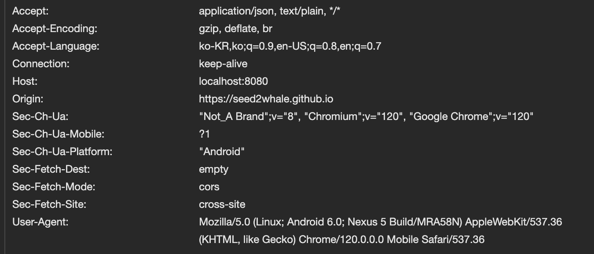

# CORS

## Contents

### F/E 애플리케이션에서 B/E REST API를 사용하는 (실제와 유사한) 상황

클라이언트에서 https://seed2whale.github.io/backend-survival-week03-front/ 다음과 같은 API로 접근한다고 하자.


지금 개발자 모드가 켜져있고, 오른쪽에 요청을 확인해보면 Request URL이 localhost:8080/posts이다. 근데 지금 localhost:8080에 서버 어플리케이션이 실행 중이 아니라서 요청이 실패했을 것이라 예상할 수 있다. 네트워크 상태도 실패라고 나와있죠?

이제 서버를 켜고 다시 요청을 보내보자.


마찬가지로 요청이 실패했다. 근데 이유가 달라졌습니다. cors 라고 나와있네요.

### Same-Origin-Policy

> [CORS](https://github.com/ahastudio/til/blob/main/http/20201205-cors.md)

> [Same-origin policy](https://developer.mozilla.org/ko/docs/Web/Security/Same-origin_policy)

Same origin policy는 기본적으로 `웹 브라우저가 처리하는 보안 정책`(서버에서는 이미 처리 끝내고 결과를 준 상태)이다.

얻으려는 리소스의 출처(호스트)가 현재 페이지(B/E 입장에서는 요청하는 쪽)와 다르면 접근할 수 없게 하는 보안 정책. 출처를 구분할 때 `포트까지 포함`된다는 점에 주의하자.

#### Origin = 출처

다시 브라우저를 살펴보자. 서버에는 200 Status code로 응답을 주었다.


확대해서 살펴보자.


Origin과 Host를 주의해서 봐야한다. Host가 서버 즉 리소스의 출처를 말한다. 반면 현재 페이지(요청하는 클라이언트)가 출처 Origin을 의미한다. 서버 입장에서 요청을 받으니까 Request Headers의 정보를 살펴보면 Origin(요청의 주체)를 알 수 있다. 즉 현재 페이지(웹 브라우저)죠?  
참고로 path가 다른 것은 무의미하다. path가 달라도 출처가 같다.

애초에 path를 추가해도 브라우저에서 origin을 식별할 때 path를 포함하지 않는 다는 것을 확인해보자. (주소 표시줄에 url에 /posts라고 포함했는데 origin은 변함이 없죠?)


### Same Origin Policy로 발생한 요청 실패를 해결해보자!

#### 1. JSONP

> [JSONP](https://ko.wikipedia.org/wiki/JSONP)

`<script>` 태그는 동일 출처를 따지지 않는다는 점을 이용하는 방식이다. 서버에서 JSON을 직접 전달하는 게 아니라, 실행되는 자바스크립트 코드(콜백 함수를 지정)를 전달하는 방식. 아래 순서를 따라가보자.

우선 클라이언트에서 아래와 같이 요청한다.

```html
<script>
  window.success = (data) => {
    // 얻은 데이터를 처리하는 코드가 들어갈 수 있음
    console.log(data);
  };
</script>

<script src="http://server/posts?callback=success"></script>
```

1. window.success 함수는 서버에서 데이터를 성공적으로 받아왔을 때 호출된다.
2. `<script>` 태그를 사용하여 외부 스크립트 파일을 로드한다. 이 때 스크립트 파일의 소스는 "http://server/posts?callback=success" 이다. 즉 callback=success는 서버에게 JSONP 요청을 보낼 때 콜백 함수의 이름을 success로 지정하는 것을 나타낸다.

서버는 아래와 같이 응답한다. JSON 데이터를 콜백 함수 이름으로 패딩하여 클라이언트에 보낸다.

```jsx
“callback” query parameter로 들어온 콜백 함수명([
	{ id: '1', title: '제목', content: '내용' }
]);
```

복잡하기 때문에 이제는 그냥 CORS 쓰자.

#### 2. CORS

> [CORS](https://developer.mozilla.org/ko/docs/Web/HTTP/CORS)

> [Access-Control-Allow-Origin](https://developer.mozilla.org/ko/docs/Web/HTTP/Headers/Access-Control-Allow-Origin)

Back-end, 즉 REST API의 응답 헤더에 “Access-Control-Allow-Origin” 속성을 포함시키는 방식이다. 서버 쪽에서 “여기(F/E)에서 요청한 거라면 괜찮아요”라고 브라우저에게 알려주는 방식.  
아래와 같이 서브 도메인이라도 다른 origin으로 인식한다.

- 웹 페이지 (F/E): https://ahastudio.com
- API 서버 (B/E): https://api.ahastudio.com

HTTP 메시지 헤더의 [Origin](https://developer.mozilla.org/ko/docs/Web/HTTP/Headers/Origin) 속성을 참고할 것.

아래는 응답 메시지의 예시다.

```
HTTP/1.1 200 OK
Access-Control-Allow-Origin: https://ahastudio.com
(...자세한 헤더는 생략…)
(빈 줄)
[
	{
		"id": "123",
		"title": "재밌는 이야기",
		"content": "는 다음 기회에…"
	}
]
```

#### 3. Spring Web MVC에서 CORS

이제 Spring의 힘을 빌려보자. 굳이 우리가 HTTP 응답 메시지를 일일히 작성할 필요는 없다.
Spring Web Mvc는 Servlet에 기반을 둔다. 따라서 HttpServletResponse 객체를 활용한다.

##### 1. HttpServletResponse

> [HttpServletResponse](https://javaee.github.io/javaee-spec/javadocs/javax/servlet/http/HttpServletResponse.html)

```java
@GetMapping
public List<PostDto> list(
HttpServletResponse response
) {
response.addHeader("Access-Control-Allow-Origin", "http://localhost:3000")};
```

Origin과 무관하게 모든 요청을 허용할 거면 그냥 “\*”로 잡아주면 된다. (와일드 카드)

```java
response.addHeader("Access-Control-Allow-Origin", "*");
```


자 이제 http://localhost:8080/posts 요청했을 때 정상적으로 목록을 불러온다. origin과 Host가 달라도 same origin policy에 의해 문제가 발생하지 않습니다.

##### 2. @CrossOrigin

> [CrossOrigin](https://docs.spring.io/spring-framework/docs/current/javadoc-api/org/springframework/web/bind/annotation/CrossOrigin.html)

Spring Web에선 @CrossOrigin 애너테이션을 써주면 된다. 클래스, 메서드 모두 지정 가능. (아래 사진 보면 @Target에 TYPE, METHOD 모두 포함되어있죠?)


우선 이 어노테이션을 사용하기 전의 기존의 HttpSevletReponse를 이용해서 Post 요청을 보내보자. 글을 생성하는 요청이다.

```<java>
// Create
    @PostMapping("")
    @ResponseStatus(HttpStatus.CREATED)
    public String create(@RequestBody PostDto body, HttpServletResponse response) {

        response.addHeader("Access-Control-Allow-Origin", "*");

        return body.getId() + body.getContent() + body.getTitle();
    }
```

위와 같이 메서드를 수정하고 등록 요청을 해보겠다.


어? post 요청이 실패했다.


왜 그럴까? 이 생성하는 요청에서 Preflight로 HTTP 요청 [OPTIONS 메서드](https://developer.mozilla.org/ko/docs/Web/HTTP/CORS)로 먼저 요청하기 때문이다. Preflight에서 CORS 에러가 발생해서 Post요청도 실패한 것이다. 그래서 이 경우 Preflight 요청에 대응하는 RESTapi 메서드를 컨트롤러에서 구현해야한다. 상당히 불편하다. 하지만 @CrossOrigin 어노테이션을 사용하면 간단히 구현할 수 있다. 아래와 같이 클래스(컨트롤러)나 메서드에 어노테이션을 달아주기만 하면 된다.

```java
@CrossOrigin("http://localhost:3000")
```

생성 요청을 할 때 실제로 추가되게 코드를 수정해보았다.

```<java>
@RestController
@CrossOrigin(origins = "*")
@RequestMapping("/posts")
public class PostController {

    private final List<PostDto> postDtoList = new ArrayList<>(List.of(
            new PostDto("1", "제목1", "내용1"),
            new PostDto("2", "제목2", "내용2"),
            new PostDto("3", "제목3", "내용3")
    ));

    // Read
    @GetMapping("")
    public List<PostDto> list() {
        return postDtoList;
    }

    // Create
    @PostMapping("")
    @ResponseStatus(HttpStatus.CREATED)
    public String create(@RequestBody PostDto body) {

        this.postDtoList.add(new PostDto("1004", body.getTitle(), body.getContent()));

        return body.getId() + body.getContent() + body.getTitle();
    }
}
```


이제 정상적으로 잘 해결되었다. 다만 지금 코드 구현상 id가 1004로 고정인데 이걸 수정하는 법은 다음주에~. 그리고 DTO 삭제를 하는 RESTapi도 구현해주자.

```<java>
// DELETE
    @DeleteMapping("/{id}")
    public PostDto delete(@PathVariable String id) {
        PostDto found = postDtoList.stream()
                .filter(postDto -> postDto.getId().equals(id))
                .findFirst()
                .get();

        this.postDtoList.remove(found);

        return found;
    }
```

모든 요청을 허용할 거라면 마찬가지로 “\*”로 잡아주면 된다.

```java
@CrossOrigin("*")
```

아무 것도 안 써도 와일드 카드와 동일한 효과가 난다.

```java
@CrossOrigin
```

##### 3. WebMvcConfigurer

지금까지는 클래스단(컨트롤러)에서 CORS 설정을 해줬죠? 어플리케이션 전체에 적용하는 법을 알아봅시다. WebMvcConfigurer 인터페이스에 대한 Spring Bean으로 환경 설정을 하면 됩니다.

이걸 어디서 찾느냐? 메인 함수가 있는 클래스에서 @SpringBootApplication -> @SpringBootConfiguration 이렇게 타고가면 Config 설정을 어디 부분이 코딩해야하는지 알 수 있는데요? Main 함수와 같은 어플리케이션 클래스 내부에 코딩해주면 됩니다. @SpringBootApplication 어노테이션이 config를 포함하기 때문에 이 어노테이션이 붙은 어플리케이션 클래스에 메서드를 추가하는 것이죠!

```java
@Bean
	public WebMvcConfigurer webMvcConfigurer() {
		return new WebMvcConfigurer() {

		@Override
		public void addCorsMappings(CorsRegistry registry) {
			registry.addMapping("/**")
							.allowedMethods("GET", "POST", "PATCH", "DELETE", "OPTIONS")
							.allowedOrigins("http://localhost:3000");
		}
	};
}
```

addMapping 메서드에 origin url을 넣게 되는데, /\*\* 이렇게 하면 어플리케이션 홈에서 하위 depth까지 모두를 포함해서 허용한다는 말입니다. 왜 2개를 썼냐면 하위 depth도 포함해서 그렇습니당.

@CrossOrigin과 마찬가지로 “\*”을 쓰거나 allowedOrigins 메서드를 따로 써주지 않으면 모든 요청을 허용할 수 있다.

## 참고

[Preflight 요청](https://developer.mozilla.org/ko/docs/Web/HTTP/CORS#%ED%94%84%EB%A6%AC%ED%94%8C%EB%9D%BC%EC%9D%B4%ED%8A%B8_%EC%9A%94%EC%B2%AD)
