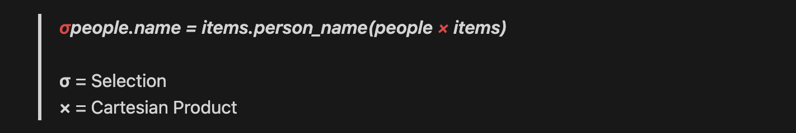

# 관계 대수

## 연산

- 산술 연산 : 1 + 2 같은 산술 표현식으로 1과 2라는 두 개의 정수의 덧셈 연산을 표현할 수 있고, 이를 계산(평가)하면 3이라는 새로운 정수를 얻을 수 있다.

- 관계의 연산 : Relation도 산술 연산처럼 연산을 통해 Relation을 얻을 수 있다.

- 연산의 종류
  - 단항 연산 : Selection, Projection, Rename
  - 이항 연산 : Cartesian Product, Set Union, Set Difference

## Projection

- 관계 대수  
원하는 Attribute들을 포함하는 Pair(속성과 속성 값)로 Tuple을 구성. 이 때 속성을 식별할 수 있는 것은 속성의 이름이죠?  
그렇게 해서 새로운 Relation(Tuple의 집합)이 만들어 진다.

- SQL  
SQL에선 SELECT절 바로 뒤에 속성 이름을 나열하는 방식으로 표현할 수 있다.

```sql
SELECT name, age, gender
FROM people;
```

특별히 속성을 제한하고 싶지 않다면 그냥 와일드카드(*)를 쓰면 된다!

## Selection

- 관계 대수  
주어진 술어(Predicate)(거칠게 말하면 “조건”)를 만족하는 Tuple만 선택.

- SQL  
SQL에선 SELECT문의 WHERE절로 술어를 표현할 수 있다.

```sql
SELECT name, age, gender
FROM people
WHERE age < 13;
```

## Cartesian product

[곱집합](https://ko.wikipedia.org/wiki/%EA%B3%B1%EC%A7%91%ED%95%A9)

- 관계대수  
Relation의 Cartesian Product는 기본적인 곱집합의 의미와 다르다. 기존에는 각 요소의 쌍을 요소로 취한다(x와 y가 있다면 (x, y)를 새로운 요소로 사용).

반면 관계 대수에서는 그냥 Tuple을 합친다. 이 때 각각 Relation의 tuple의 개수가 곱해져 새로운 Relation의 tuple의 개수가 된다.

- SQL  
SQL에선 그냥 FROM 뒤에 관계(SQL에선 Table) 이름을 나열하면 된다.

```sql
SELECT *
FROM r1, r2;
```

기존의 테이블은 아래와 같다.

| r1_col1 1 | r1_col2 2 | r1_col3 3 |
|----------|----------|----------|
| id1 | name1| age1 |
| id2 | name2 | age2 |
| id3 | name3 | age3 |

| r2_col1 1 | r2_col2 2 | r2_col3 3 |
|----------|----------|----------|
| id2 | name2 | age2 |
| id3 | name3 | age3 |
| id4 | name4 | age4 |

카다시안 곱의 결과는 이렇게 된다. 결과의 튜플 수는 9개다.

| r1_col1 1 | r1_col2 2 | r1_col3 3 | r2_col1 1 | r2_col2 2 | r2_col3 3 |
|----------|----------|----------|----------|----------|----------|
| id1 | name1 | age1 | id2 | name2 | age2 |
| id2 | name2 | age2 | id2 | name2 | age2 |
| id3 | name3 | age3 | id2 | name2 | age2 |
| id1 | name1 | age1 | id3 | name3 | age3 |
| id2 | name2 | age2 | id3 | name3 | age3 |
| id3 | name3 | age3 | id3 | name3 | age3 |
| id1 | name1 | age1 | id4 | name4 | age4 |
| id2 | name2 | age2 | id4 | name4 | age4 |
| id3 | name3 | age3 | id4 | name4 | age4 |

### Join

대부분은 Cartesian Product를 그대로 사용하지 않고 Selection과 함께 사용하는데, 이를 Join이라고 한다.

견우, 직녀 등 사람을 다루는 관계 people이 있고, 각 사람이 소유한 물건을 다루는 관계 items가 있을 때, 사람의 이름(name)을 키로 사용한다면 다음과 같이 표현할 수 있다.



SQL로 표현하면 다음과 같다.

- 속성 이름이 겹칠 경우엔 관계(SQL에선 Table) 이름과 마침표를 써서 특정해줄 수 있다.
- 속성 이름을 바꿔주기 위해 AS도 함께 써주자.

```sql
SELECT people.name, age, gender, items.name AS item_name, usage
FROM people, items
WHERE people.name = items.person_name;
```

SQL에선 SELECT와 WHERE로 표현할 수도 있지만, JOIN을 쓰면 편하다.

```sql
SELECT people.name, age, gender, items.name AS item_name, usage
FROM people
JOIN items ON people.name = items.person_name;
```

기존의 테이블은 아래와 같다.

| r1_col1 | r1_col2 | r1_col3 |
|---------|---------|---------|
| id1 | name1| age1 |
| id2 | name2 | age2 |
| id3 | name3 | age3 |

| r2_col1 | r2_col2 | r2_col3 |
|---------|---------|---------|
| id2 | name2 | age2 |
| id3 | name3 | age3 |
| id4 | name4 | age4 |

Join을 사용해보자

```SQL
SELECT r1.*, r2.*
FROM r1
JOIN r2 ON r1.r1_col1 = r2.r2_col1;
```

| r1_col1 | r1_col2 | r1_col3 | r2_col1 | r2_col2 | r2_col3 |
|---------|---------|---------|---------|---------|---------|
| id2 | name2 | age2 | id2 | name2 | age2 |
| id3 | name3 | age3 | id3 | name3 | age3 |

### OUTER JOIN

OUTER JOIN을 사용하면 조건을 만족하지 않는 null pair을 포함한 tuple도 포함된다. 이 때 JOIN의 피연산 Relation 중 어떤 Relation의 빈 tuple을 포함 시키냐에 따라 LEFT or RIGHT를 선택하면 된다. (원래 관계 대수에서는 이런 개념이 없지만 SQL에서는 존재함)

아무 것도 소유하지 않은 사람을 포함시키고 싶다면 LEFT OUTER JOIN을 사용하면 된다. 즉 FROM의 피연산자인 테이블을 포함하는 것이다.

```sql
SELECT people.name, age, gender, items.name AS item_name, usage
FROM people
LEFT OUTER JOIN items ON people.name = items.person_name;
```

누구도 소유하지 않은 아이템을 포함시키고 싶다면 LEFT 대신 RIGHT를 쓰면 된다. 하지만 이렇게 쓰지 않는 걸 추천한다. LEFT JOIN을 사용하도록 FROM에 들어가는 테이블을 변경해주자.

즉 SELECT - FROM items과 LEFT Join으로 아이템에 초점에 두는 것을 권한다.

```sql
SELECT people.name, age, gender, items.name AS item_name, usage
FROM people
RIGHT OUTER JOIN items ON people.name = items.person_name;
```

```sql
SELECT people.name, age, gender, items.name AS item_name, usage
FROM items
LEFT OUTER JOIN people ON items.person_name = people.name;
```

기존의 테이블은 아래와 같다.

| r1_col1 | r1_col2 | r1_col3 |
|---------|---------|---------|
| id2 | name2 | age2 |
| id3 | name3 | age3 |

| r2_col1 | r2_col2 | r2_col3 |
|---------|---------|---------|
| id3 | name3 | age3 |
| id4 | name4 | age4 |

Outer Join을 사용해보자

```SQL
SELECT r1.*, r2.*
FROM r1
LEFT JOIN r2 ON r1.r1_col1 = r2.r2_col1;
```

| r1_col1 | r1_col2 | r1_col3 | r2_col1 | r2_col2 | r2_col3 |
|---------|---------|---------|---------|---------|---------|
| id2 | name2 | age2 | null | null | null |
| id3 | name3 | age3 | id3 | name3 | age3 |

```SQL
SELECT r1.*, r2.*
FROM r1
RIGHT JOIN r2 ON r1.r1_col1 = r2.r2_col1;
```

| r1_col1 | r1_col2 | r1_col3 | r2_col1 | r2_col2 | r2_col3 |
|---------|---------|---------|---------|---------|---------|
| id3 | name3 | age3 | id3 | name3 | age3 |
| null | null | null | id4 | name4 | age4 |