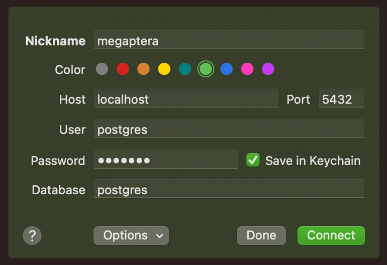

# 환경 설정

## Docker에 PostgreSQL 설치

```<text>
# 도커 설치
brew install docker

# Spotlight(command + space)에서 docker 검색 후 실행

# docker 에 postgres 도커 이미지 다운받기
docker pull postgres

# postgres 이미지 실행(포트는 자동으로 5432 로 세팅됩니다.)
docker run -p 5432:5432 --name demo -e POSTGRES_PASSWORD=password -d postgres

# docker 실행 확인
docker ps
```

## Postico 사용하기

- postico 설치: `brew install --cask postico`

아래와 같이 제공된 postgres 서버에 접속

